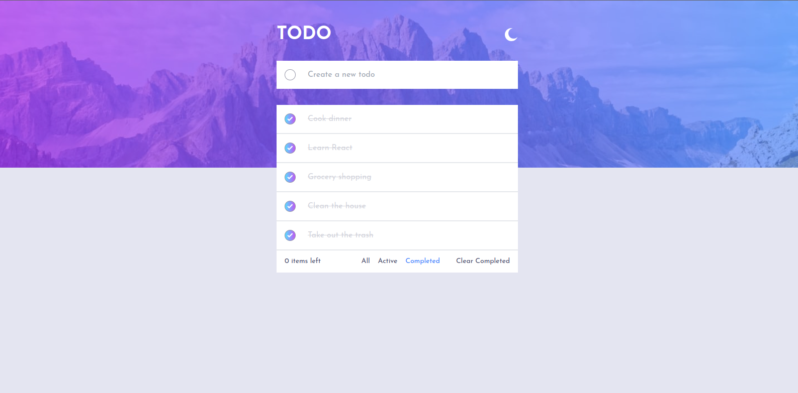

# Frontend Mentor - Todo app solution

This is a solution to the [Todo app challenge on Frontend Mentor](https://www.frontendmentor.io/challenges/todo-app-Su1_KokOW). Frontend Mentor challenges help you improve your coding skills by building realistic projects.

## Table of contents

- [Overview](#overview)
  - [The challenge](#the-challenge)
  - [Screenshot](#screenshot)
  - [Links](#links)
- [My process](#my-process)
  - [Built with](#built-with)
- [Author](#author)

## Overview

### The challenge

Users should be able to:

- View the optimal layout for the app depending on their device's screen size
- See hover states for all interactive elements on the page
- Add new todos to the list
- Mark todos as complete
- Delete todos from the list
- Filter by all/active/complete todos
- Clear all completed todos
- Toggle light and dark mode
- **Bonus**: Drag and drop to reorder items on the list

### Screenshot

### Links

- Solution URL: (https://github.com/diahabib/todo-app)
- Live Site URL: (https://todo-app-puce-tau-45.vercel.app/)

## My process

### Built with

- Semantic HTML5 markup
- CSS
- Mobile-first workflow
- [React](https://reactjs.org/) - JS library
- TypeScript (https://www.typescriptlang.org/) - TypeScript
- Tailwind (https://tailwindcss.com/) - Tailwind

## Author

- Frontend Mentor - (https://www.frontendmentor.io/profile/diahabib)
- Twitter - (https://www.twitter.com/habibdia16)
- Github - (https://github.com/diahabib)
